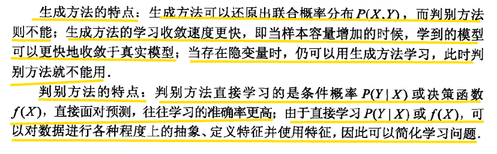

# 第一章 统计学习方法概论

> 统计学习方法三要素：模型、策略和算法

## 1.1 统计学习

### 1.统计学习的特点

> 统计学习(statistical learning):计算机基于数据构建概率统计模型并运用模型对数据进行预测与分析的一门学科，也称为统计及其学习(statistical machine learning)

* 以计算机及网络为平台，建立在计算机及网络之上

* 以数据为研究对象，是数据驱动的学科

* 目的是对数据进行预测和分析

* 统计学习是概率论、统计学、信息论、最优化理论及计算机科学等多个领域的交叉学科

>如果一个系统能够通过执行某个过滤改进它的性能，这就是学习-赫尔伯特西蒙

### 2.统计学习的对象

>统计学习的对象是数据，对数据的基本假设是同类数据具有一定的统计规律性。

### 3.统计学习的目的

对数据进行预测和分析，特别是对未知新数据进行预测与分析

### 4. 统计学习的方法

基于数据构建模型

分类：

* 监督学习(supervised learning)
* 非监督学习(unsupervised learning)
* 半监督学习(semi-supervised learning)
* 强化学习(reinforcement learning)

### 5.统计学习的研究

* 统计学习方法(statistical learning method)
* 统计学习理论(statistical learning theory)
* 统计学习应用(application of statistical learning)

## 1.2 监督学习

>监督学习的任务是学习一个模型，使模型能够对任意给定的输入，对其相应的输出做出一个好的预测。

### 1.2.1 基本概念

* 输入空间(input space)与输出空间(output space):输入与输出可能取值的集合
* 特征空间(feature space):具体的输入是一个实例，由特征向量(feature vector)表示，所有特征向量存在的空间叫做特征空间

输入变量，输出变量分别用 $X$ , $Y$ 表示，表示输出变量的取值用小数表示，$x^{(i)}$ 表示 $x$ 的第 $i$ 个特征，$x_i$ 表示第 $i$ 多个输出变量的第 $i$ 个，$x_i$ 表示如下所示

$$x_i = (x_i^{(1)}, x_i^{(2)},..., x_i^{(n)})^T$$

监督学习一般由输入和输出对组成，表示如下

$$T = \{(x_1, y_1), (x_2, y_2), ..., (x_N, y_N)\}$$

#### 分类

* **回归**：输入输出均为连续
* **分类**: 输出变量为有限个离散变量的预测问题
* **标注**: 输入输出均为变量序列的预测问题

## 1.3 统计学习三要素

$$方法 = 模型 + 策略 + 算法$$

### 1.3.1 模型

> 模型即要学习的条件概率分布或决策函数。模型的假设空间(hypothesis space)包含所有可能的条件概率分布或者决策函数

* 决策函数表示的模型为非概率模型
* 条件概率表示的模型为概率模型

### 1.3.2 策略

#### 1. 损失函数和风险函数

* **损失函数**：度量模型一次预测的好坏
* **风险函数**：度量平均意义下模型预测的好坏

>用损失函数(loss function)或代价函数(cost function)度量预测值与真实值不一致的程度

常见的**损失函数**：

* 0-1损失函数(0-1 losss function)

$$L(Y,f(x))=
\begin{cases}
1& \text{Y != f(x)}\\
0& \text{Y = f(x)}
\end{cases}$$

* **平方损失函数(quadratic loss function)**

$$L(Y,f(X))=(Y-f(X))^2$$

* 绝对损失函数(absolute loss function)

$$L(Y,f(X))=|Y-f(X)|$$

* 对数损失函数(logarithmic loss function)或对数使然损失函数(log-likelihood loss function)

$$L(Y,P(Y|X))=-\log P(Y|X)$$

>损失函数值越小，模型就越好

期望损失(expected loss)或**风险函数**(risk function)

>理论上模型 $f(x)$ 关于联合分布 $P(X,Y)$ 的平均意义下的损失，称为风险函数或期望损失，即

$$ R_{exp}(f) = E_p[L(Y,f(X))]=\int_{x \times y}L(y,f(x))P(x,y)dxdy$$

>学习的目标是选择期望风险最小的模型

由于联合分布 $P(X,Y)$ 是未知的，故利用大数定律，用**经验风险$R_{exp}(f)$**估计期望风险

模型 $f(X)$ 关于训练数据集的平均损失称为经验损失(empirical risk)或经验损失(empirical loss)，记为 $R_{exp}$

$$R_{exp}(f)=\frac{1}{N}\sum \limits_{i=1}^{N}L(y_i,f(x_i))$$

* 期望风险 $R_{exp}(f)$ 是模型关于联合分布的期望损失
* 经验风险 $R_{exp}(f)$ 是模型关于训练样本集的平均损失

>根据大数定律，当样本容量N趋于无穷时，经验风险 $ R_{exp}(f)$ 趋于期望风险 $R_{exp}(f)$ .为了在小样本的情况下用经验风险估计期望风险，需要对经验风险进行一定的矫正. 监督学习的两个基本策略：经验风险最小化和结构风险最小化.

#### 2. 经验风险最小化与机构风险最小化

**经验风险最小化**(empirical risk minization, ERM)策略认为，经验风险最小的模型就是最优的模型

$$\min \limits_{f \in F}\frac{1}{N}\sum \limits_{i=1}^NL(y_i,f(x_i))$$

* 样本数量足够大时，经验风险最小化能保证有很好的学习效果，在现实中被广泛采用
* 样本数量很小时，容易产生“过拟合(over-fitting)”现象

**结构风险最小化**(structuak risk minization, SRM)是为了防止过拟合而提出的策略，等价于正则化(regularizer)或罚项(penalty term)

$$ R_{srm}(f) = \frac{1}{N} \sum \limits_{i=1}^N L(y_i, f(x_i))+\lambda J(f)$$

式中，$J(f)$ 为模型的复杂度，$\lambda$是权衡经验风险和模型复杂度的系数，$\lambda \geq 0$

* 结构风险小，经验风险与模型复杂度同时小
* 结构风险小的模型往往对悬链数据以及位置的测试数据都有较好的预测

### 1.3.3 算法

算法一般是指求解最优化解的方法，有显式的解析解，求解很简单，否则就需要通过数值计算的方法求解全局最优解

## 1.4 模型评估与模型选择

### 1.4.1 训练误差与测试误差

#### 训练误差

>**训练误差**(training error)是基于损失函数的模型，主要是关于训练数据集的平均损失

$$R_{exp}(\widehat{f})=\frac{1}{N}\sum \limits_{i=1}^NL(y_i,\widehat{f}(x_i)) $$

其中 $N$ 为训练样本的容量

#### 测试误差

>**测试误差**(test error)是关于测试数据集的平均损失

$$e_{test} = \frac{1}{N'}\sum \limits_{i=1}^{N'}L(y_i,\widehat{f}(x_i))$$

其中 $N'$ 表示测试数据集的样本容量

* 测试误差的大小，可以判断给定问题是否容易学习
* 测试误差反映了学习方法对未知的测试数据集的预测能力
* 测试误差小的方法具有更好的预测能力，是更有效的方法

### 1.4.2 过拟合与模型选择

* 过拟合(over-fitting)指一味追求对训练数据的预测能力，选择的模型复杂对比真实的模型更高
* 过拟合导致模型对已知的数据预测的很好，但是对于未知的数据预测很差的现象
* 模型的选择不仅要考虑到对已知数据的预测能力，还要考虑到对未知数据的预测能力

## 1.5 正则化与交叉验证

### 1.5.1 正则化

>正则化(regularization)是一种典型的模型选择方法，是结构风险最小化策略的实现，是在经验风险上加上一个正则化项(regularizer)或者罚项(penalty term)

$$\min \limits_{f\in F}\frac{1}{N} \sum \limits_{i=1}^NL(y_i,f(x_i))+\lambda J(f)$$

其中第一项为经验风险，第二项为正则化项，$\lambda \geq 0$为调整两者之间关系的系数

* 正则化的作用是选择经验风险与模型风险同时较小的模型
* 正则化符合**奥卡姆剃刀(Occam's razor)原理**:在所有选择的模型中，能够很好地解释已知数据并且十分简单才是最好的模型，也是应该选择的模型

### 1.5.2 交叉验证

>**交叉验证(cross validation)**:随机地将数据集切分为三部分，分别为训练集(traing set)、验证集(validation set)和测试集(test set)

* 训练集训练模型
* 验证集用于模型的选择
* 测试集用于最终学习方法的评估

一般的验证方法有以下三种

* 简单交叉验证
* S折交叉验证
* 留一交叉验证

## 1.6 泛化能力

### 1.6.1 泛化误差

**泛化误差**(generalization ability)是指由该学习方法学习到的模型对未知数据的预测能力，是学习方法本质上的重要性质

一般地，可以认为泛化误差就是所学习到的模型的期望风险

### 1.6.2 泛化误差上界

**泛化误差上界**(generalization error bound)是指泛化误差的概率上界，用于分析学习方法的泛化能力

定理1.1(泛化误差上界) 对于二类分类问题，当假设空间是有限个函数的集合 $F={f_1,f_2,...,f_d}$ 时，对于任意一个函数 $f \in F$ ，至少以概率 $1-\delta$ ，以下不等式成立:

$$R(f)\leq\hat{R}(f)+\epsilon(d,N,\delta) \tag{1.25}$$

$$\epsilon(d,N,\delta)=\sqrt{\frac{1}{2N}(\log d + \log \frac{1}{\delta})} \tag{1.26}$$

不等式(1.25)左端为泛化误差，右端为泛化误差上界，右端第一项为训练误差，训练误差越小，泛化误差也越小，第二项为关于 $N$ 的单调递减函数，当 $N$ 趋于无穷时趋于0

## 1.7 生成模型与判别模型

监督学习分为生成方法(generative approach)与判别方法(discriminative approach)，所学到的模型分别称为生成模型(generative model)和判别模型(discriminative model)

生成模型有:

* 朴素贝叶斯法
* 隐马可夫模型

判别模型有：

* K近邻法
* 感知机
* 决策树
* 逻辑斯谛回归模型
* 最大熵模型
* 支持向量机
* 提升方法
* 条件随机场

**生成方法与判别方法的对比**:

## 1.8 分类问题

* 监督学习从数据中学习一个分类模型或者分类决策函数，称为分类器(classifier)
* 分类器对新的输入进行输出的预测(prediction)，称为分类(classfication)，可能的输出称为类(class)

评价分类器性能的指标一般是分类**准确率**(accuracy)：对于给定的测试数据集，分类器正确分类的样本数和总样本数之比

对于二类分类的问题一般的评价指标是精确率(precision)与召回率(recall)

分类可能出现的四种情况：

* TP-将正类预测为正类(True Positive)
* FN-将正类预测为负类(False Negative)
* FP-将负类预测为正类(False Positive)
* TN-将负类预测为负类(True Negative)

精确率定义为:

$$P=\frac{TP}{TP+FP}$$

召回率定义为：

$$R=\frac{TP}{TP+FN}$$

$F1$ 值，精确率和召回率的调和均值

$$\frac{2}{F_1} = \frac{1}{P}+\frac{1}{R}$$

$$F_1=\frac{2TP}{2TP+FP+FN}$$

## 1.9 标注问题

>标注常用的统计学习方法有:隐马可夫模型、条件随机场

## 1.10 回归问题

>回归用于预测输入变量和输出变量之间的关系，其等价于函数拟合

* 按照输入变量的个数，分为一元回归和多元回归
* 按照输入变量和输出变量之间的关系分为线性回归和非线性回归

