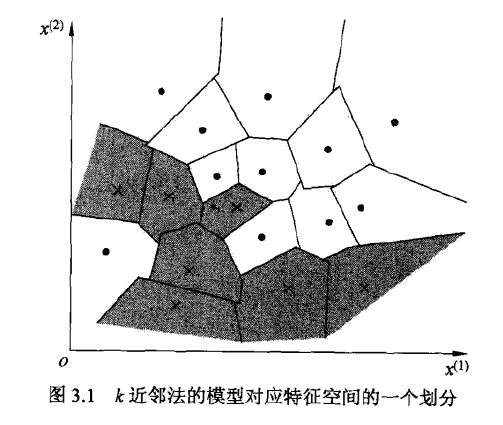

# 第三章 k近邻法

k近邻法(k-nearnest neighbor, K-NN)是一种基本分类与回归方法.

* 对于输入的实例，k近邻法通过多数表决等方式进行预测，故其不具有显式的学习过程;
* 三个基本要素是：K值的选择、距离度量及分类决策准则.

## 3.1 k近邻算法

**算法 3.1**(k近邻法)
*输入*: 训练数据集
$$T={(x_1,y_1),(x_2,y_2),...,(x_N,y_N)}$$
其中，$x_i \in X \subseteq \mathbb{R}^n$ 为实例的特征向量，$y_i \in Y = {c_1,c_2,...,c_k}$ 为实例的类别，$i=1,2,...,N$ , 实例特征向量$x$.
*输出*: 实例$x$所属的类$y$.
(1) 根据给定的距离度量，在训练集$T$中找出与$x$最邻近的$k$个点，涵盖这个点的$x$的邻域记作$N_k(x)$:
(2) 在$N_k(x)$中根据分类规则(如多数表决)决定$x$的类别$y$：

$$y=arg \max \limits_{c_j} \sum \limits_{x_i \in N_k(x)}I(y_i=c_j), i=1,2,...,N; j=1,2,...,K$$
其中，$I$为指示函数，即当 $y_i=c_j$ 时 $I=1$，否则$I=0$.

## 3.2 k近邻模型

> k近邻法使用的模型实际上对应于特征空间的划分

### 3.2.1 模型

* k近邻法中，当其三要素基本确定后，对于一个新的输入实例，它所属的类唯一地确定.

* k近邻法分类类似于将特征空间划分为一些子空间，确定子空间的每个点所属的类

### 3.2.2 距离度量

特征空间中两个实例点的距离是两个实例点相似程度的反映.距离计算有以下几种方法:

* 欧氏距离
* $L_p$距离($L_p$ distance)
* Minkowski距离(Minkowski distance)

**$L_p$距离**

$$L_p(x_i,x_j)=(\sum \limits_{l=1}^n |x_i^{(l)}-x_j^{(l)}|^p)^{\frac{1}{p}},(p \geq 1)$$

* $p=2$时，称为欧氏距离(Euclidean distance)
* 当$p=1$时，称为曼哈顿距离(Manhattan distance)
* 当$p=\infty$时，它是各个坐标距离的最大值

### 3.2.3 K值的选择

> k值的选择会对k近邻法的结果产生重大影响.

* k值较小，相当于选择较小的邻域中的训练实例进行预测，学习的近似误差(approximation error)会减小，但是估计误差(estimation error)会增大.即k值的减小就意味着整体模型变的复杂，容易发生过拟合;
* k值较大，相当于用较大的训练实例进行预测，可以减少学习的估计误差，但是近似误差会增大.即k值的增大意味着整体的模型变的简单.

> 在应用中，k值一般取一个比较小的数值.通常采用交叉验证法来选取最优的k值.

### 3.2.4 分类决策规则

一般是**多数表决**，即由输入实例的k个邻近的训练实例中的多数类决定输入实例的类.

## 3.3 k近邻法的实现：kd树

> 实现k近邻法时，主要考虑的问题是如何对训练数据进行快速k近邻搜索

* 简单地实现方法是线性扫描(linear scan)，计算输入实例与每一个训练实例的距离. 在训练集很大时，计算十分耗时
* $kd$ 树($kd$ tree)方法

### 3.3.1 构造$kd$树

> $kd$ 树是一种对$k$维空间中的空间进行存储以便对其进行快速检索的树形数据结构，是一种二叉树

构造 $kd$ 树的算法如下所示：

**算法3.2** (构造平衡$kd$树)
*输入*: $k$ 维空间数据集$T={x_1,x_2,...,x_N}$, 其中$x_1=(x_i^{(1)},x_i^{(2)},...,x_i^{(k)}), i=1,2,...,N$
*输出*: $kd$ 树
(1) 开始：构造根节点，根节点对应于包含 $T$ 的 $k$ 维空间的矩形区域.
选择 $x^{(i)}$ 为坐标轴，以 $T$ 中所有实例的 $x^{(i)}$ 坐标的中位数为切分点，将根节点对应的超矩形区域切分为两个子区域.切分由通过切分点并与坐标轴 $x^{(i)}$ 垂直的超平面实现.
由根节点生成深度为1的左、右子节点；左子节点对应坐标 $x^{(l)}$ 小于切分点的子区域，右子节点对应与坐标 $x^{(i)}$ 大于切分点的值区域.
将落在切分超平面上的实例点保存在根节点.

(2) 重复：对深度为$j$的结点，选择$x^{(i)}$ 为切分的坐标轴，$l=j(mod k)+1$，以该结点的区域中所有实例的$x^{(i)}$ 坐标的中位数为切分点，将该结点对应的超矩形区域切分为两个子区域.切分由通过切分点并与坐标轴$x^{(i)}$ 垂直的超平面实现.
由该结点生成深度为$j+1$的左、右子结点，左子结点对应于坐标$x^{(i)}$小于切分点的子区域，右子结点对应坐标$x^{(i)}$大于切分点的子区域.
将落在切分超平面上的实例点保存在该结点.
(3) 直到两个子区域没有实例存在时停止，从而形成$kd$树的区域划分.

### 3.3.2 搜索 $kd$ 树

> 使用$kd$树可以省去对大部分数据点的搜索，从而减少搜索的计算量.

